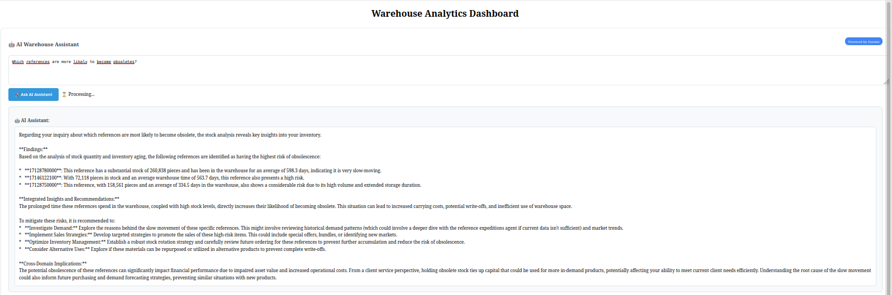
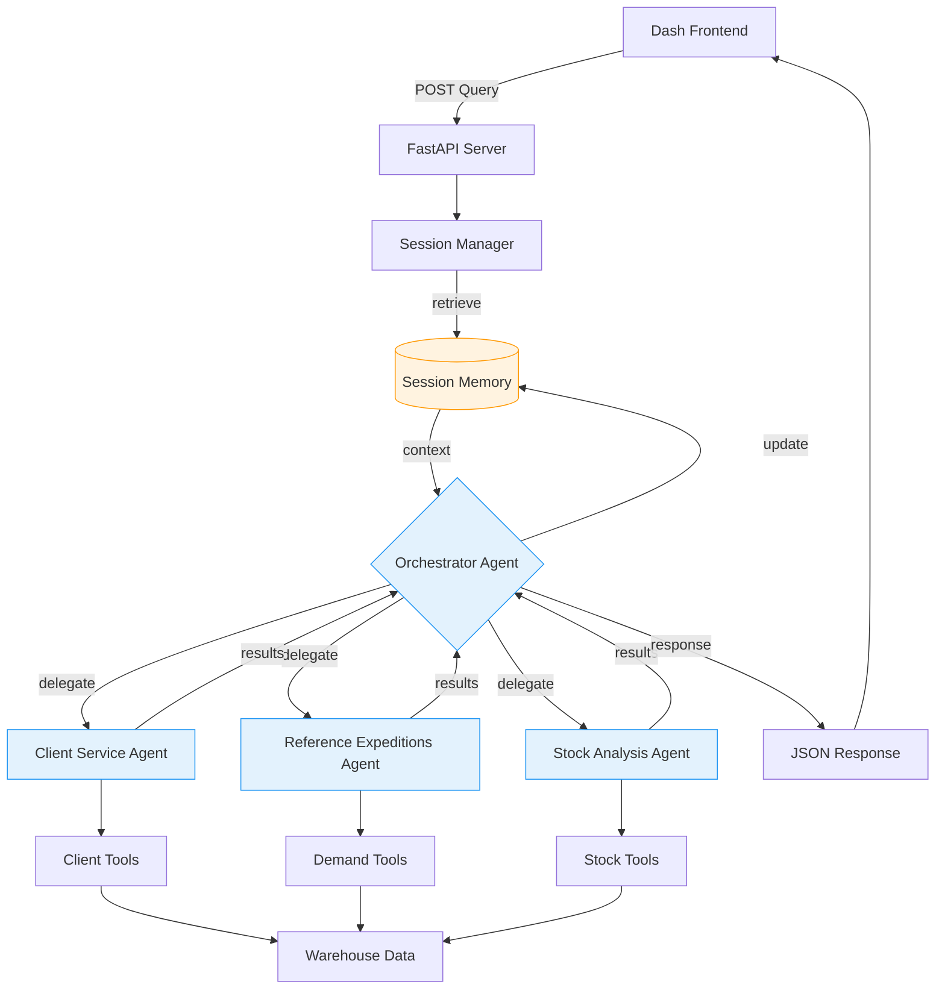

# Warehouse Analytics Dashboard with AI Agents

## 📊 Project Overview

A comprehensive warehouse analytics dashboard built with Plotly Dash, enhanced with specialized AI agents powered by Google Gemini. This project provides intelligent insights into client service levels, material demand forecasting, and inventory management.

<!-- Embedding a GitHub Release video with HTML5 -->
<video width="640" height="360" controls>
  <source src="https://github.com/jfrometa88/capstone_project_new/releases/tag/video" type="video/mp4">
  Your browser does not support the video tag.  
</video>

[](assets/video.mp4)

## 🚀 Features

### Dashboard Features
- **Client Service Level Analysis**: Track and visualize client performance metrics
- **Reference Demand Analysis**: Analyze material demand patterns and trends  
- **Stock & Inventory Analysis**: Monitor stock levels and inventory aging
- **Interactive Filters**: Filter by year, month, client count, and reference count
- **Real-time Visualizations**: Dynamic charts and tables with professional styling

### AI-Powered Insights
- **🤖 Intelligent Assistant**: Natural language queries about warehouse data
- **Specialized Agents**: Three domain-specific AI agents:
  - **Client Service Agent**: Client performance and service level analysis
  - **Reference Expeditions Agent**: Demand patterns and forecasting
  - **Stock Analysis Agent**: Inventory optimization and aging analysis
- **Orchestrator Agent**: Routes queries to appropriate specialized agents

## 🛠 Technology Stack

### Frontend & Visualization
- **Plotly Dash**: Interactive web dashboard
- **Plotly Graph Objects**: Advanced data visualizations
- **HTML/CSS**: Custom styling and responsive design
- **Requests (communication)**: HTTP client to synchronously consume the FastAPI AI service. 

### Backend & Data Processing
- **Python 3.13**: Core programming language
- **FastAPI**: Asynchronous API to manage Dashboard interaction with IA.
- **Pandas**: Data manipulation and analysis
- **Openpyxl**: Excel file processing

### AI & Machine Learning
- **Google ADK**: Agent development kit
- **Gemini 2.5 Flash**: Large language model
- **Custom Tools**: Modular function tools for data analysis

### 🐳 Docker Architecture

The project uses a multi-container Docker setup for better scalability and isolation:

### Container Structure
- **api_app**: FastAPI backend with AI agents (Port 8000)
- **dash_app**: Plotly Dash frontend (Port 8050) 
- **Shared Volume**: `common/` directory for shared utilities and data

### Benefits
- **Isolated Environments**: Separate dependencies for API and Dashboard
- **Easy Deployment**: One command to start all services
- **Development Consistency**: Same environment across all machines
- **Scalability**: Easy to scale individual components

## 📁 Project Structure
```text
warehouse-analytics/
│
├── common/ # Shared resources between containers
│ ├── utils/ # Data processing utilities
│ │ ├── data_loader.py # Excel data loading functions
│ │ ├── expedition_analysis.py # Client service analysis
│ │ ├── reference_analysis.py # Demand forecasting
│ │ ├── stock_analysis.py # Inventory analysis
│ │ └── logger.py # Logging configuration
│ │
│ ├── data/ # Sample data (mounted volume)
│ │ ├── expediciones_test.xlsx
│ │ └── ubicaciones_test.xlsx
│ │
│ └── init.py
│
├── api_app/ # FastAPI Backend Container
│ ├── IA_api.py # FastAPI server entry point
│ ├── agents/ # AI agents implementation
│ │ ├── agent.py # Agent definitions and tools
│ │ ├── agent_manager.py # Agent session management
│ │ └── init.py
│ ├── config.py # Configuration and model settings
│ ├── requirements.txt # Python dependencies for API
│ ├── Dockerfile.api # API container definition
│ ├── .env # Environment variables
│ └── init.py
│
├── dash_app/ # Dash Frontend Container
│ ├── app.py # Dash application entry point
│ ├── requirements.txt # Python dependencies for Dashboard
│ ├── Dockerfile.dash # Dashboard container definition
│ └── init.py
│
├── docker-compose.yml # Multi-container orchestration
├── README.md
├── LICENSE
└── .gitignore
```


## 🏗 Architecture

### Data Flow
1. **Data Loading**: Excel files → Pandas DataFrames
2. **Processing**: Modular functions in `common/utils`
3. **Visualization**: Dash components and Plotly charts
4. **AI Integration**: Natural language → Agent tools → Insights

### Agent Architecture



## ⚙️ Installation & Setup

### Prerequisites
- Python 3.13
- Google Gemini API key
- Git
- Docker and Docker Compose (Optional)

### Step-by-Step Setup

#### Quick Start with Docker (Recommended)

1. **Clone the repository**
   
```bash
git clone https://github.com/jfrometa88/capstone_project_new.git
cd capstone_project_new

```

2. **Enviroment configuration**

```bash
# Create .env file
cp .env.example .env
# Edit .env and add your Gemini API key
echo "GEMINI_API_KEY=your_google_gemini_api_key_here" >> .env
```
3. **Prepare sample data**

- Place your Excel files in the common/data/ directory

- Ensure files follow the expected column structure

4. **Run with Docker Compose**

```bash
docker-compose up --build
```

5. **Access the applications**

- Dashboard: http://localhost:8050

- API Docs: http://localhost:8000/docs

- API Health: http://localhost:8000/health

#### Manual Development Setup

If you prefer to run without Docker:

1. **Create virtual environment**
   
```bash
python -m venv venv
source venv/bin/activate  # On Windows: venv\Scripts\activate
```

3. **Install dependencies**

```bash
cd api_app 
pip install -r requirements.txt

cd ..
cd dash_app
pip install -r requirements.txt
```

4. **Environment configuration**

```bash
# Create .env file
echo "GEMINI_API_KEY=your_google_gemini_api_key_here" > .env
```

5. **Prepare sample data**

- Place your Excel files in the data/ directory

- Ensure files follow the expected column structure

6. **Run the IA backend server**

```bash
python api_app/IA_api.py
```

7. **Run the Dashboard application**
_Open a new terminal_

```bash
python dash_app/app.py
```

1. **Access the dashboard**

- Open [http://127.0.0.1:8050] in your browser


## 📊 Data Requirements

### Expeditions Data (expediciones_test.xlsx)

- idlinea: Integer - Line identifier

- idReferencia: Integer - Material reference ID

- referencia: String - Material name

- cantidadPedida: Numeric - Ordered quantity

- cantidadServida: Numeric - Shipped quantity

- fechaTransporte: Date - Shipment date

### Stock Data (ubicaciones_test.xlsx)

- Ubicación: String - Warehouse location

- referencia: String - Material reference

- HU: String - Handling unit identifier

- Piezas: Numeric - Quantity in location

- fecha: Date - Entry date

## 🤖 AI Agent Usage

### Example Queries

- Client Analysis: "Show me the top 5 clients and their service levels"

- Demand Forecasting: "Forecast next month demand for top references"

- Stock Analysis: "Analyze inventory aging for high-stock items"

- Performance: "Generate service level report for this year"

### Available Tools

The AI agents have access to specialized tools:

- Client ranking and metrics

- Service level calculations

- Demand time series analysis

- Stock quantity and aging analysis

- Demand forecasting models

#### 🔍 Observability and Tracing

The system incorporates tracing, seamlessly integrated via an ADK Plugin, to provide full visibility into the agent's decision-making process. This capability ensures that the entire lifecycle of any user query—from Orchestrator planning to specialized Tool Execution is fully auditable, confirming the strategic success of the multi-agent design.

## 🎯 Business Value

### For Warehouse Managers

- Real-time visibility into client service levels

- Data-driven inventory optimization

- Proactive demand forecasting

- Identification of operational bottlenecks

### For Business Analysts

- Comprehensive performance dashboards

- AI-powered insights without technical expertise

- Historical trend analysis

- Predictive analytics capabilities

- AI Service Resilience and Error Isolation: API errors (such as rate limit errors like 429) from the Gemini service are now gracefully handled by the FastAPI backend. This prevents direct UI crashes in the Dash frontend, ensuring a stable and professional user experience, even during high-traffic or resource-constrained scenarios.

### Operational Benefits

- **Containerized Deployment**: Easy to deploy and scale in production

- **Environment Consistency**: Same behavior across development, staging, and production

- **Resource Isolation**: API and Dashboard run in isolated environments

- **Rapid Scaling**: Easy to scale individual components based on load

### Development Benefits  

- **Simplified Onboarding**: New developers can start with one command

- **Dependency Management**: No conflicts between API and Dashboard dependencies

- **CI/CD Ready**: Dockerized setup integrates easily with modern DevOps pipelines

## 🔧 Customization

### Adding New Data Sources

- Extend `common/utils/data_loader.py`

- Create new analysis modules in common/utils

- Add corresponding visualization components

- Integrate with existing agent tools

### Creating New Agents

- Define specialized tools in `api_app/agents/specialized_agents.py`

- Create agent with domain-specific instructions

- Register with orchestrator in `api_app/agents/orchestrator_agent.py`

## 🚨 Troubleshooting

### Common Issues

#### API Key Errors

- Verify GEMINI_API_KEY in .env file

- Check Google Cloud project billing status

#### Data Loading Issues

- Verify Excel file paths and column names

- Check file permissions in data/ directory

#### Agent Initialization Failures

- Verify internet connectivity for API calls

- Check Python dependency versions

#### Dashboard Not Loading

- Verify port 8050 is available

- Check Dash and Plotly versions compatibility

- **Dashboard Not Responding to AI Queries**: Verify that the FastAPI agent server is running on http://localhost:8000

### Docker Issues

- **Port conflicts**: Ensure ports 8000 and 8050 are available

- **Build failures**: Check Dockerfile syntax and requirements.txt

- **Volume mounting**: Verify file permissions in `common/` directory

- **Container communication**: Ensure both services can reach each other

## 📈 Future Enhancements

### Planned Features

- Real-time data streaming integration

- Advanced forecasting models (ARIMA, LSTM)

- Multi-warehouse support

- Mobile-responsive design

- Export functionality for reports

- User authentication and roles

### AI Enhancements

- Custom fine-tuned models

- Automated anomaly detection

- Prescriptive analytics recommendations

- Natural language data updates

## 👥 Contributing

### Fork the repository

- Create feature branch (git checkout -b feature/AmazingFeature)

- Commit changes (git commit -m 'Add AmazingFeature')

- Push to branch (git push origin feature/AmazingFeature)

- Open Pull Request

## 📄 License

This project is licensed under the **GNU General Public License v3.0 (GPLv3)** - see the LICENSE file for details.

Note: This project was developed as part of a Google AI course capstone project, focusing on practical applications of AI agents in business analytics.


