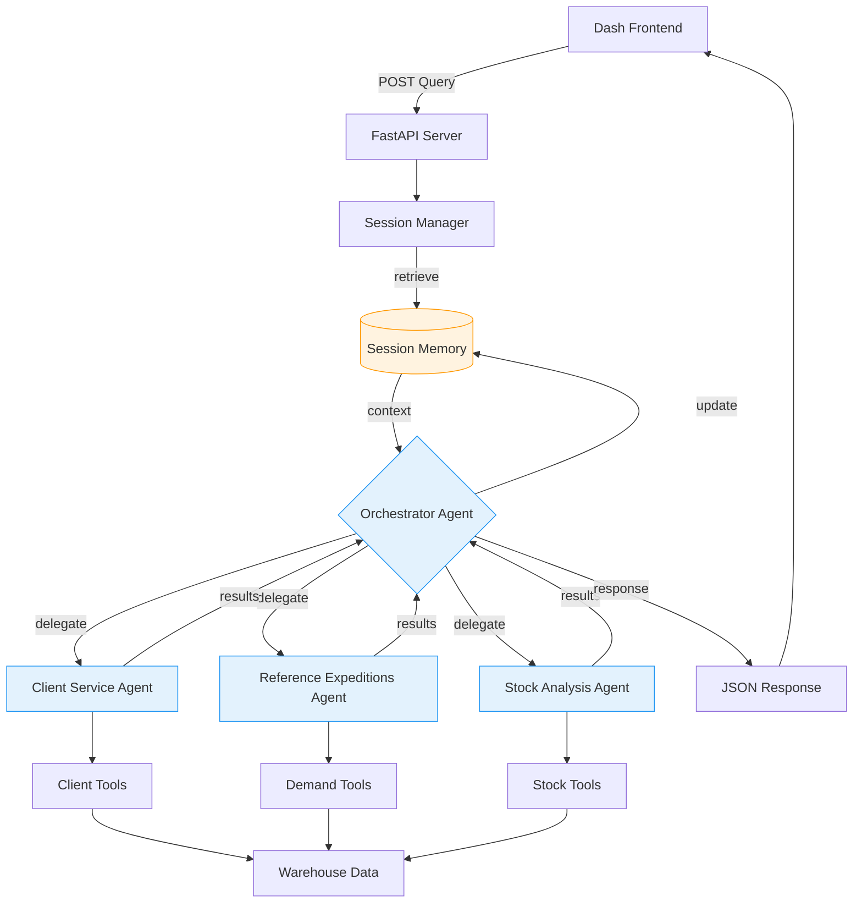

# Warehouse Analytics Dashboard with AI Agents

## 📊 Project Overview

A comprehensive warehouse analytics dashboard built with Plotly Dash, enhanced with specialized AI agents powered by Google Gemini. This project provides intelligent insights into client service levels, material demand forecasting, and inventory management.

## 🚀 Features

### Dashboard Features
- **Client Service Level Analysis**: Track and visualize client performance metrics
- **Reference Demand Analysis**: Analyze material demand patterns and trends  
- **Stock & Inventory Analysis**: Monitor stock levels and inventory aging
- **Interactive Filters**: Filter by year, month, client count, and reference count
- **Real-time Visualizations**: Dynamic charts and tables with professional styling

### AI-Powered Insights
- **🤖 Intelligent Assistant**: Natural language queries about warehouse data
- **Specialized Agents**: Three domain-specific AI agents:
  - **Client Service Agent**: Client performance and service level analysis
  - **Reference Expeditions Agent**: Demand patterns and forecasting
  - **Stock Analysis Agent**: Inventory optimization and aging analysis
- **Orchestrator Agent**: Routes queries to appropriate specialized agents

## 🛠 Technology Stack

### Frontend & Visualization
- **Plotly Dash**: Interactive web dashboard
- **Plotly Graph Objects**: Advanced data visualizations
- **HTML/CSS**: Custom styling and responsive design
- **Requests (communication)**: HTTP client to synchronously consume the FastAPI AI service. 

### Backend & Data Processing
- **Python 3.13**: Core programming language
- **FastAPI**: Asynchronous API to manage Dashboard interaction with IA.
- **Pandas**: Data manipulation and analysis
- **Openpyxl**: Excel file processing

### AI & Machine Learning
- **Google ADK**: Agent development kit
- **Gemini 2.5 Flash**: Large language model
- **Custom Tools**: Modular function tools for data analysis

## 📁 Project Structure
```text
warehouse-analytics/
├── app.py # Main Dash application
├── IA_api.py # Main fastapi application for IA service
├── config.py # Configuration of IA models
├── agents/ # AI agents implementation
│ ├── init.py
│ ├── agent.py # Main orchestrator agent and agents tools
│ └── agent_manager.py # Agent session management
├── utils/ # Data processing modules
│ ├── data_loader.py # Excel data loading
│ ├── expedition_analysis.py # Client service analysis
│ ├── reference_analysis.py # Demand forecasting
│ └── stock_analysis.py # Inventory analysis
│ └── logger.py # logging module tool
├── data/ # Sample data files
│ ├── expediciones_test.xlsx # Expedition data
│ └── ubicaciones_test.xlsx # Stock location data
├── assets/ # Static assets
├── requirements.txt # Python dependencies
└── .env # Environment variables
```


## 🏗 Architecture

### Data Flow
1. **Data Loading**: Excel files → Pandas DataFrames
2. **Processing**: Modular functions in `/utils`
3. **Visualization**: Dash components and Plotly charts
4. **AI Integration**: Natural language → Agent tools → Insights

### Agent Architecture



## ⚙️ Installation & Setup

### Prerequisites
- Python 3.13
- Google Gemini API key
- Git

### Step-by-Step Setup

1. **Clone the repository**
   
```bash
git clone <repository-url>
cd warehouse-analytics
```
    
2. **Create virtual environment**
   
```bash
python -m venv venv
source venv/bin/activate  # On Windows: venv\Scripts\activate
```

3. **Install dependencies**

```bash
pip install -r requirements.txt
```

4. **Environment configuration**

```bash
# Create .env file
echo "GEMINI_API_KEY=your_google_gemini_api_key_here" > .env
```

5. **Prepare sample data**

- Place your Excel files in the data/ directory

- Ensure files follow the expected column structure

6. **Run the IA backend server**

```bash
python IA_api.py
```

7. **Run the Dashboard application**
_Open a new terminal_

```bash
python app.py
```

1. **Access the dashboard**

- Open [http://127.0.0.1:8050] in your browser


## 📊 Data Requirements

### Expeditions Data (expediciones_test.xlsx)

- idlinea: Integer - Line identifier

- idReferencia: Integer - Material reference ID

- referencia: String - Material name

- cantidadPedida: Numeric - Ordered quantity

- cantidadServida: Numeric - Shipped quantity

- fechaTransporte: Date - Shipment date

### Stock Data (ubicaciones_test.xlsx)

- Ubicación: String - Warehouse location

- referencia: String - Material reference

- HU: String - Handling unit identifier

- Piezas: Numeric - Quantity in location

- fecha: Date - Entry date

## 🤖 AI Agent Usage

### Example Queries

- Client Analysis: "Show me the top 5 clients and their service levels"

- Demand Forecasting: "Forecast next month demand for top references"

- Stock Analysis: "Analyze inventory aging for high-stock items"

- Performance: "Generate service level report for this year"

### Available Tools

The AI agents have access to specialized tools:

- Client ranking and metrics

- Service level calculations

- Demand time series analysis

- Stock quantity and aging analysis

- Demand forecasting models

## 🎯 Business Value

### For Warehouse Managers

- Real-time visibility into client service levels

- Data-driven inventory optimization

- Proactive demand forecasting

- Identification of operational bottlenecks

### For Business Analysts

- Comprehensive performance dashboards

- AI-powered insights without technical expertise

- Historical trend analysis

- Predictive analytics capabilities

- AI Service Resilience and Error Isolation: API errors (such as rate limit errors like 429) from the Gemini service are now gracefully handled by the FastAPI backend. This prevents direct UI crashes in the Dash frontend, ensuring a stable and professional user experience, even during high-traffic or resource-constrained scenarios.

## 🔧 Customization

### Adding New Data Sources

- Extend utils/data_loader.py

- Create new analysis modules in /utils

- Add corresponding visualization components

- Integrate with existing agent tools

### Creating New Agents

- Define specialized tools in agents/specialized_agents.py

- Create agent with domain-specific instructions

- Register with orchestrator in agents/orchestrator_agent.py

## 🚨 Troubleshooting

### Common Issues

#### API Key Errors

- Verify GEMINI_API_KEY in .env file

- Check Google Cloud project billing status

#### Data Loading Issues

- Verify Excel file paths and column names

- Check file permissions in data/ directory

#### Agent Initialization Failures

- Verify internet connectivity for API calls

- Check Python dependency versions

#### Dashboard Not Loading

- Verify port 8050 is available

- Check Dash and Plotly versions compatibility

- **Dashboard Not Responding to AI Queries**: Verify that the FastAPI agent server is running on http://localhost:8000

## 📈 Future Enhancements

### Planned Features

- Real-time data streaming integration

- Advanced forecasting models (ARIMA, LSTM)

- Multi-warehouse support

- Mobile-responsive design

- Export functionality for reports

- User authentication and roles

### AI Enhancements

- Custom fine-tuned models

- Automated anomaly detection

- Prescriptive analytics recommendations

- Natural language data updates

## 👥 Contributing

### Fork the repository

- Create feature branch (git checkout -b feature/AmazingFeature)

- Commit changes (git commit -m 'Add AmazingFeature')

- Push to branch (git push origin feature/AmazingFeature)

- Open Pull Request

## 📄 License

This project is licensed under the **GNU General Public License v3.0 (GPLv3)** - see the LICENSE file for details.

## 🙏 Acknowledgments

- Google Gemini for AI capabilities

- Plotly Dash for visualization framework

- Pandas community for data processing tools

- Course instructors and mentors

Note: This project was developed as part of a Google AI course capstone project, focusing on practical applications of AI agents in business analytics.

