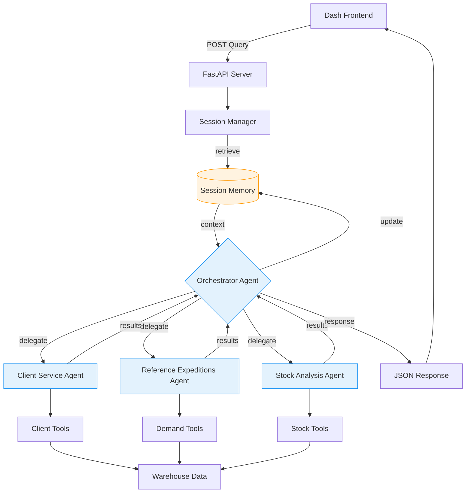

# Warehouse Analytics AI Agent: Decoupled Multi-Agent System (FastAPI & Gemini 2.5 Flash)

## Submission Track: Enterprise Agents

### 🎯 Problem Statement: From Data Log to Strategic Insight

Traditional Warehouse Management Systems (WMS or SGA) excel at granular operational management but fail to provide the intelligent, rapid data analysis required for tactical and strategic decision-making. Business analysts rely on manual data exports and external Business Intelligence (BI) tools to answer critical questions (e.g., obsolescence projection, service level analysis), resulting in reactive decision-making and high operational friction. This project addresses this gap by developing an autonomous, conversational AI module that provides immediate, actionable insights into complex warehouse data via natural language.

---

### 🧠 Why Multi-Agents? Strategic Delegation and Expertise

Warehouse analytics is a complex domain requiring **specialized expertise**. A single, general-purpose Large Language Model (LLM) cannot reliably perform specific calculations like Service Level compliance or detailed Inventory Aging analysis.

Our solution employs a **Hierarchical Multi-Agent System** where the core principle is strategic delegation:

* **Orchestrator Agent:** Interprets the user's intent and routes the query to the correct domain expert (e.g., "client service" or "stock analysis").
* **Specialized Agents:** Three domain-specific agents (Client Service, Reference Expeditions, Stock Analysis) are created, each possessing custom Python tools and domain context to ensure calculation accuracy and reliable responses.

---

### 🏗️ Project Architecture: Decoupled Service Model

The project implements an enterprise-grade **Decoupled Microservice Architecture** for superior scalability and resilience.

* **Frontend (UI Layer):** Plotly Dash provides the interactive data visualization and user interface.
* **Backend (AI Layer):** **FastAPI** acts as the dedicated, asynchronous API server, managing all AI processing and tool execution.
* **AI Core:** Google ADK and **Gemini 2.5 Flash** power the orchestration and specialized agents.

This separation ensures **error isolation**: AI service outages or API errors are managed by the FastAPI backend, preventing the client application (Dash) from crashing and ensuring a stable user experience.

---

### Demo: Validation and Auditable Trajectory

The core value of this project is the seamless integration of the **conversational AI module** directly into the **Plotly Dash Dashboard**. Users interact via the chat interface, which forwards the query to the FastAPI/Agent backend, receives the analyzed results, and displays the final business insight.

The system's execution path is fully auditable via **ADK Plugin Tracing**, confirming the strategic success of the Orchestrator's planning in real-time.

#### Scenario 1: Client Service Level Analysis

**User Interaction:** A manager types the query into the **Dash Chat Interface**: `Show me the top 5 clients and their service levels for the year 2025 in month 1`

* **Orchestration & Validation:** The Orchestrator correctly identifies the query's domain and delegates control to the **Client Service Agent**. The internal trace confirms the routing and tool execution sequence:
    1.  `🔍 [TRACE] Agent 'warehouse_orchestrator_agent' started`
    2.  `🔍 [TRACE] Agent 'client_service_agent' started`
    3.  `api - INFO - Getting top 5 clients for year=2025, month=1`
* **Dashboard Output:** The insight is returned via FastAPI to Dash and displayed instantly in the chat window, providing actionable recommendations for KPI data.

#### Scenario 2: Inventory Aging and Obsolescence

**User Interaction:** A stock analyst uses the **Dash UI** to ask: `Which references are more likely to become obsoletes?`

* **Orchestration & Validation:** The Orchestrator correctly delegates the request to the **Stock Analysis Agent**. The trace confirms the sequential tool use required for the complex calculation:
    1.  `🔍 [TRACE] Agent 'warehouse_orchestrator_agent' started`
    2.  `🔍 [TRACE] Agent 'stock_analysis_agent' started`
    3.  `api - INFO - Calculated average time in warehouse for references: {...}`
* **Dashboard Output:** The resulting list of high-risk references is presented in the chat, enabling the analyst to immediately cross-reference these items with the visual inventory charts already present in the Dash UI.

---

### 🛠️ The Build: Core Concepts, Tracing, and Robustness

The implementation adheres to the **Agent Quality** principle and successfully delivers **seven (7) core concepts** from the course:

1.  **Multi-agent System:** Hierarchical structure with the Orchestrator delegating to three specialized agents.
2.  **Agent powered by an LLM:** All agents utilize **Gemini 2.5 Flash** for optimized performance and superior function calling accuracy.
3.  **Custom Tools:** Modular Python functions (leveraging **Pandas**) defined and executed by specialized agents to perform KPI calculations (e.g., `get_top_clients`, `get_avg_time_in_warehouse`).
4.  **Sessions & State Management:** Uses ADK's `InMemorySessionService` to maintain full conversational context and state (`session_id`) across follow-up queries.
5. **Tracing & Efficiency (Trajectory Auditability):** Implemented via the **ADK Plugin** (minimal_tracing_plugin), providing the "Glass Box" view essential for Observability. This tracing capability provides a complete audit of the agent’s decision-making trajectory, confirming that "**The Trajectory is the Truth**".
**Empirical Validation:** Trace analysis confirms the strategic success of the Orchestrator's routing. For instance, the system consistently routes 'Inventory Aging' queries to the dedicated `stock_analysis_agent_`. Critically, the analysis of the full delegated trajectory showed that the specialized analysis completed in approximately 7 seconds, validating the project’s adherence to the **Efficiency** pillar of Agent Quality (Operational Cost/Latency).
6.  **Observability & Robustness:** Features a mandatory **Exponential Backoff** mechanism on all API calls (4 attempts) to ensure system resilience and gracefully handle transient failures and rate limit errors (429).
7.  **Production-Ready Deployment (Bonus):** The project is fully **containerized** using separate **Dockerfiles** for the FastAPI Backend and the Dash Frontend, demonstrating enterprise-grade readiness for deployment on Cloud Run.

---

### 💡 If I had more time, this is what I'd do

* **Agent Evaluation (Golden Dataset):** Finalize and automate the agent evaluation script using a defined Golden Dataset to continuously validate the strategic success of the Orchestrator's routing decisions.
* **Real-Time Data Integration:** Replace static data loading with integration to a live data stream (e.g., Kafka or Pub/Sub) to provide minute-by-minute operational insights.
* **External Tool Linking:** Integrate with core WMS/ERP APIs to enable agents to perform prescriptive actions (e.g., "Create a stock transfer order") based on their analysis.
* **User Authentication and Roles:** Implement secure user authentication to control access to sensitive data and restrict tool usage based on user roles.